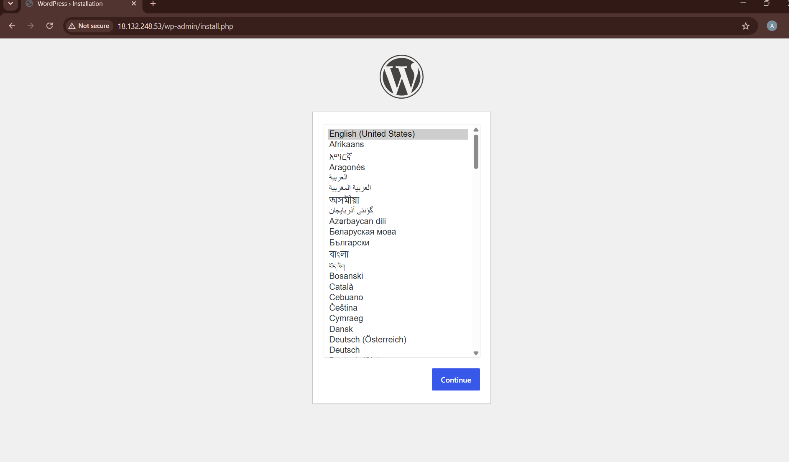
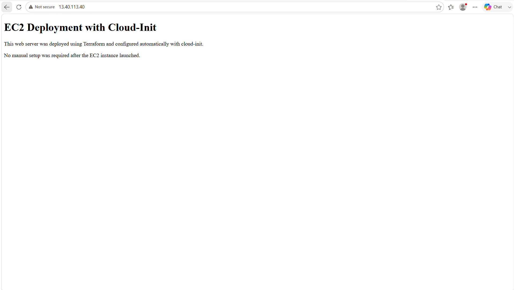

# Terraform AWS Assignments

This repository contains Terraform assignments completed as part of my DevOps learning.

The projects demonstrate how Terraform can be used to automate AWS infrastructure deployment using Infrastructure as Code.

## Repository Structure

```text
terraform/
├── assignment-1-wordpress/
│   ├── screenshots/
│   │   └── wordpress.png
│   ├── .gitignore
│   ├── .terraform.lock.hcl
│   ├── main.tf
│   ├── outputs.tf
│   ├── provider.tf
│   ├── user_data.sh
│   └── variables.tf
│
└── assignment-2-cloud-init-ec2/
    ├── screenshots/
    │   └── cloud-init-working.png
    ├── .gitignore
    ├── cloud-init.yaml
    ├── main.tf
    ├── outputs.tf
    ├── provider.tf
    └── variables.tf
```

# Assignment 1 – WordPress Deployment with Terraform

## Objective

This project uses Terraform to deploy a WordPress website on AWS.

The aim was to create AWS infrastructure using code instead of manually setting everything up in the AWS Console.

## What I Built

I deployed a WordPress website on an AWS EC2 instance using Terraform.

Terraform creates the infrastructure, including the EC2 instance and security group. When the EC2 instance starts, a user data script runs automatically to install and configure Apache, MariaDB, PHP, and WordPress.

## Setup Includes

* EC2 instance running WordPress
* Security group allowing HTTP access
* User data script to install WordPress dependencies
* Public URL to access the WordPress site
* Infrastructure created and managed using Terraform

## Files Used

* `main.tf` – creates the AWS resources, including the EC2 instance and security group rules
* `provider.tf` – configures the AWS provider and selected AWS region
* `variables.tf` – stores reusable values such as the AWS region, AMI ID, and instance type
* `outputs.tf` – shows the public IP address and WordPress URL after deployment
* `user_data.sh` – installs and configures Apache, MariaDB, PHP, and WordPress on the EC2 instance
* `.gitignore` – prevents Terraform state files and local generated files from being pushed to GitHub
* `.terraform.lock.hcl` – records the provider version used by Terraform
* `screenshots/wordpress.png` – shows the working WordPress deployment

## Terraform Commands Used

* `terraform init`
* `terraform fmt`
* `terraform validate`
* `terraform plan`
* `terraform apply`
* `terraform output`

## Screenshot

The screenshot below shows WordPress running successfully.




# Assignment 2 – EC2 Deployment with Cloud-Init

## Objective

This project uses Terraform and cloud-init to deploy an EC2 instance that automatically configures itself when it starts.

The aim was to create an EC2 instance that comes online fully configured with no manual setup after launch.

## What I Built

I deployed an EC2 instance using Terraform and passed a cloud-init YAML file into the instance using `user_data`.

When the EC2 instance starts, cloud-init runs automatically. It updates the package list, installs Apache, creates a custom HTML page, and starts the Apache web server.

## Setup Includes

* EC2 instance deployed using Terraform
* Security group allowing HTTP access
* Cloud-init YAML file passed through Terraform `user_data`
* Apache installed automatically on boot
* Custom HTML page created automatically
* Public URL to access the web page

## Files Used

* `main.tf` – creates the EC2 instance, security group, HTTP rule, SSH rule, outbound rule, and passes cloud-init using `user_data`
* `provider.tf` – configures the AWS provider and selected AWS region
* `variables.tf` – stores reusable values such as the AWS region, AMI ID, and instance type
* `outputs.tf` – shows the public IP address and website URL after deployment
* `cloud-init.yaml` – installs Apache, creates the web page, and starts the Apache service automatically
* `.gitignore` – prevents Terraform state files and local generated files from being pushed to GitHub
* `screenshots/cloud-init-working.png` – shows the working cloud-init deployment

## Terraform Commands Used

* `terraform init`
* `terraform fmt`
* `terraform validate`
* `terraform plan`
* `terraform apply`
* `terraform output`

## Cloud-Init Workflow

The cloud-init file performs the server setup automatically when the EC2 instance boots.

It uses:

* `package_update` to update the package list
* `packages` to install Apache
* `write_files` to create `/var/www/html/index.html`
* `runcmd` to enable and start Apache

Terraform passes the cloud-init file into the EC2 instance using:

```hcl
user_data = file("${path.module}/cloud-init.yaml")
```

This means the EC2 instance is fully configured automatically when it launches.

## Screenshot

The screenshot below shows the Apache web page created by cloud-init.




This assignment helped me understand the difference between creating infrastructure with Terraform and configuring a server automatically with cloud-init.
